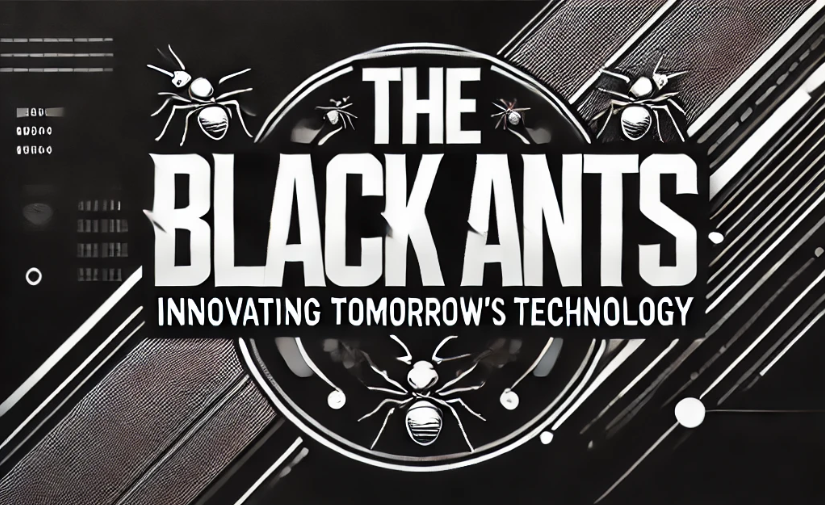

<h2 align="center">🛠 Technologies and Tools 🛠</h2>
 
<!-- https://simpleicons.org/ -->

&nbsp;

&nbsp;

&nbsp;

&nbsp;

&nbsp;

&nbsp;

&nbsp;

&nbsp;

&nbsp;

&nbsp;

&nbsp;

&nbsp;

&nbsp;

&nbsp;

&nbsp;

&nbsp;

&nbsp;

&nbsp;

&nbsp;

&nbsp;

 

 
<!-- https://icons8.com -->

  
  
  
  
  

 

<h2 align="center">📖 MISSION AND VISION 📖</h2>

<strong>🔹 MISSION</strong>
We create value for customers, contribute to the development of society, and ensure sustainability for businesses.

<strong>🔹 VISION</strong>
To become the leading enterprise in the region in the field of software development and digital transformation applications for all businesses.

<h2 align="center">💎 CORE VALUES 💎</h2>

<strong>✔️ ACCURACY</strong>
Accuracy is our guiding principle for every step of development.

<strong>🤝 CONNECTION</strong>
Connection creates strength.

<strong>🔒 INTEGRITY</strong>
We always aim for an honest environment to create stability and sustainability, which in turn drives long-term development.

<h2 align="center">🛠️ PRODUCTS/SERVICES 🛠️</h2>
<ul>
  <li>📦 Software Development/Maintenance</li>
  <li>📱 Mobile Application Development</li>
  <li>🌐 Website Development</li>
  <li>🎨 UI/UX Design</li>
  <li>💳 Financial Technology.../New Technologies</li>
  <li>🔍 QA & Testing</li>
</ul>

<h2 align="center">🚀 DEVELOPMENT STRATEGY 🚀</h2>

<h3>📈 A- Search and Scale:</h3>

<strong>🔍 Research and develop many new technologies with the goal of expansion.</strong>
The company continues to search for quality personnel, connect with reputable new partners and clients with market demand, in order to build a large and sustainable network, serving as a foundation for strong future growth.

<h3>🛠️ B- Research and build new business models with highlights:</h3>

Strengthen research into the development and changes of the market, as well as customer preferences, to propose and build new production methods and business models, thus contributing to the company’s growth in the market.

<h3>🛠️ C- Develop high-quality human resources:</h3>

<strong>👥 Human resources</strong> must always be prioritized for both quantity and quality development to meet the company’s growth speed.

Staff are regularly and professionally trained in knowledge and skills to keep up with job requirements and maintain and meet increasing customer and partner demands for both product and service quality.

<strong>👨‍🏫 Preparing and training leadership staff</strong> to be ready to manage new projects is also a priority for the company.

<h2 align="center">🐜 CONCLUSION 🐜</h2>

The Black Ants commits to continuing development in the spirit of the black ants: working hard, accurately, honestly, and always united.

Our goal is to become a trusted partner for businesses, providing quality, creative software solutions that bring sustainable value to customers and the community.

Just like a colony of ants overcoming all difficulties together, The Black Ants will keep moving forward to achieve solid and long-lasting success.

  <strong>🔗 Contact me on Facebook: <a href="https://www.facebook.com/profile.php?id=61567337396115" target="_blank">https://www.facebook.com/TheBlackAnts</a></strong>
   
  <strong>📧 Or via Email: <a href="info@theblackants.com" target="_top">info@theblackants.com</a></strong>

